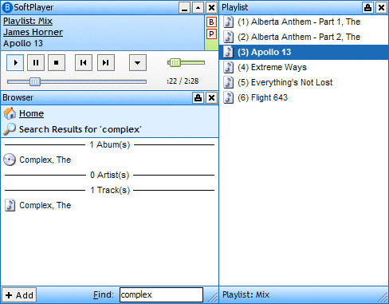

<div align="center">

## BSoftPlayer 4\.0b5 SQL\-Based Media Player


</div>

### Description

BSoftPlayer 4.0b5 is the latest release in a line of media players in development since 2001. With a SQL backend, BSoftPlayer handles tens of thousands of tracks without bogging down. Instantly search through thousands of tracks organized by artist, album, and genre. Create your own favorites list. Customize the keyboard shortcuts any way you like them - they work even when BSoftPlayer is in the background. Full mouse wheel support. Full playlist support with drag and drop from iTunes and Windows Explorer. BASS sound system with MP3/WMA/Vorbis/WAV support. Fully ID3v1 and ID3v2 compatible.
 
### More Info
 


<span>             |<span>
---                |---
**Submitted On**   |
**By**             |[Brian Cairns](https://github.com/Planet-Source-Code/PSCIndex/blob/master/ByAuthor/brian-cairns.md)
**Level**          |Advanced
**User Rating**    |4.2 (21 globes from 5 users)
**Compatibility**  |VB 6\.0
**Category**       |[Complete Applications](https://github.com/Planet-Source-Code/PSCIndex/blob/master/ByCategory/complete-applications__1-27.md)
**World**          |[Visual Basic](https://github.com/Planet-Source-Code/PSCIndex/blob/master/ByWorld/visual-basic.md)
**Archive File**   |[](https://github.com/Planet-Source-Code/brian-cairns-bsoftplayer-4-0b5-sql-based-media-player__1-52778/archive/master.zip)


### Source Code

```
Installer:
http://osdn.dl.sourceforge.net/sourceforge/bsoftplayer/bspsetup4b5.exe
Source Code:
http://osdn.dl.sourceforge.net/sourceforge/bsoftplayer/BSoftPlayer4b5.zip
It is recommended that you use the installer to install the correct controls before using the source code.
```

